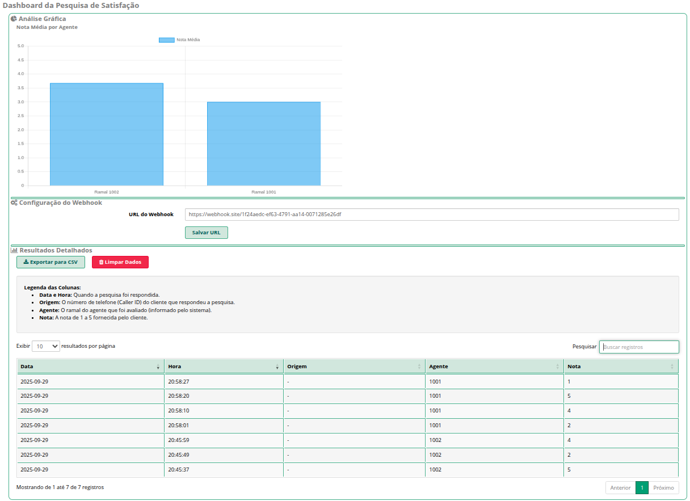

# Sistema de Pesquisa de Satisfação por Transferência para Asterisk (FreePBX/IncrediblePBX)

Este projeto implementa uma solução completa e confiável de pesquisa de satisfação pós-atendimento para PABX baseados em FreePBX e IncrediblePBX. O método utilizado é o de **transferência manual**, onde o agente, ao final do atendimento, transfere o cliente para um ramal virtual que inicia a URA de pesquisa.

Esta abordagem garante controle total ao agente, se integra de forma simples e robusta ao fluxo de chamadas e captura os dados essenciais para a avaliação do atendimento.

## Funcionalidades Principais

- **URA de Pesquisa por Transferência:** Agente transfere a chamada para o ramal `*777` para iniciar a pesquisa.
- **Armazenamento Local:** Os resultados são salvos em um arquivo CSV simplificado.
- **Integração com Webhook:** Envia os dados da pesquisa em tempo real para uma URL externa em formato JSON.
- **Dashboard Web Integrado:** Um módulo para o painel do FreePBX permite:
    - Visualizar os resultados em uma tabela interativa com **paginação, busca e ordenação**.
    - Analisar a **nota média por agente** através de um gráfico de barras.
    - Gerenciar a **URL do webhook** sem precisar de acesso SSH.
    - **Exportar** todos os dados para um arquivo CSV.
    - **Limpar** todo o histórico de dados com um clique.

---

## Estrutura do Repositório

Para uma instalação correta, o repositório deve ter a seguinte estrutura:

```
.
├── audio/
│   ├── pesquisa-agradecimento.wav
│   ├── pesquisa-boas-vindas.wav
│   └── pesquisa-opcao-invalida.wav
├── install.sh
└── README.md
```

- **`audio/`**: Esta pasta deve conter os três arquivos de áudio da URA, previamente gravados no formato correto (**WAV, 8000 Hz, 16-bit, Mono**).
- **`install.sh`**: O script de instalação automatizada.

---

## Guia de Instalação Rápida

1.  **Clone o Repositório:**
    Conecte-se ao seu servidor PABX via SSH e clone este repositório.
    ```bash
    git clone https://github.com/ivannhabilis/asterisk-satisfaction-survey.git
    cd asterisk-satisfaction-survey
    ```

2.  **Torne o Script Executável:**
    ```bash
    chmod +x install.sh
    ```

3.  **Execute a Instalação:**
    O script fará todo o trabalho de criação de arquivos, configuração do dialplan, cópia dos áudios e instalação do módulo web.
    ```bash
    sudo ./install.sh
    ```

4.  **Configure o Webhook (Opcional):**
    - Acesse a interface web do seu PABX.
    - Navegue até **Reports -> Pesquisa de Satisfação**.
    - Insira a URL do seu webhook e clique em "Salvar URL".

## Como Usar

A utilização do sistema é extremamente simples para o agente:

1.  Atenda uma chamada de cliente normalmente.
2.  Ao final da conversa, informe ao cliente que ele será transferido para uma breve pesquisa.
3.  Use a função de **transferência** do seu softphone ou telefone IP e transfira a chamada para o ramal:
    ```
    *777
    ```
A pesquisa será iniciada para o cliente, e o agente já pode encerrar sua parte da chamada.

<div align="center">
  
</div>
